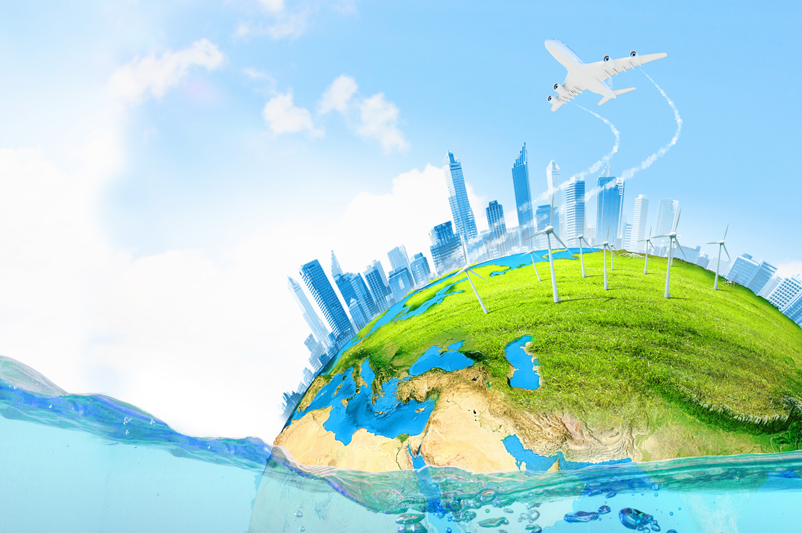
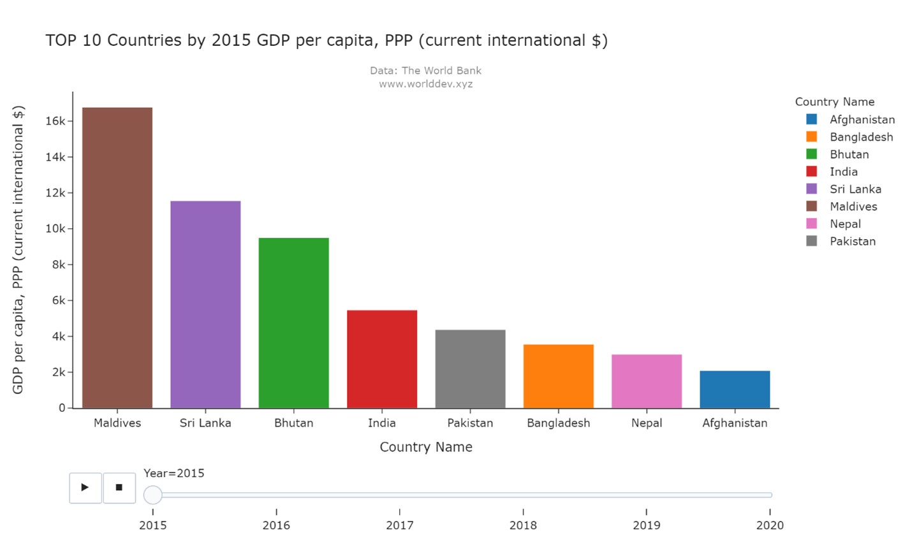
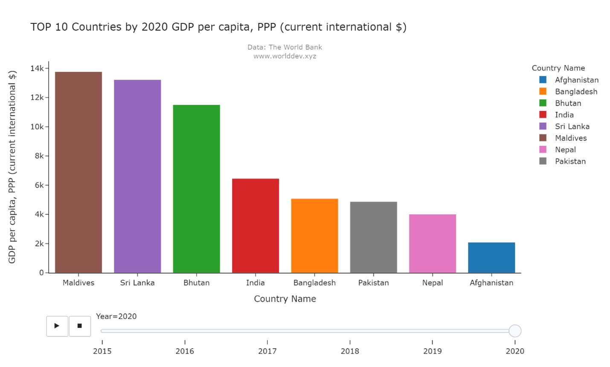
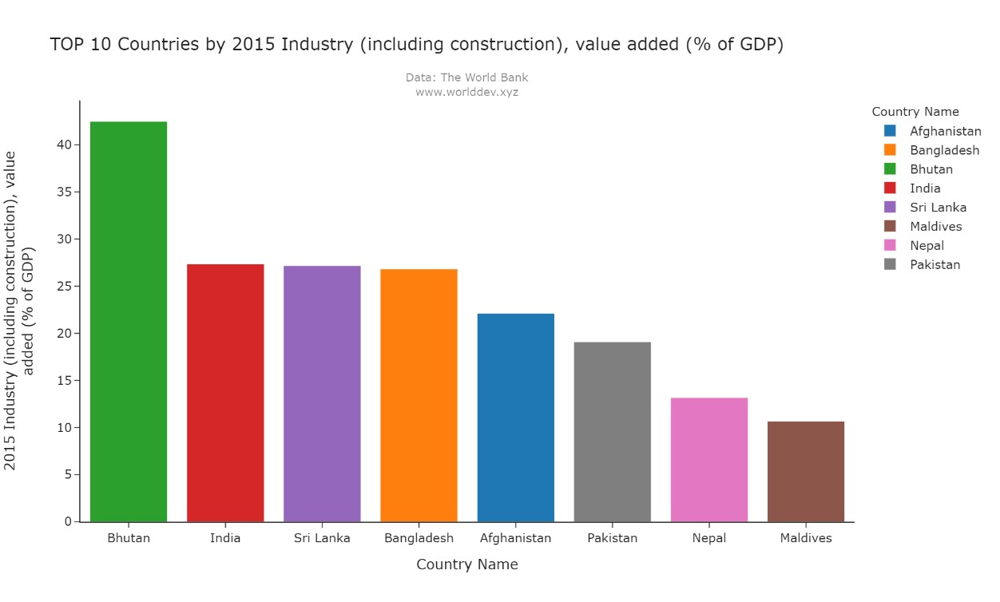
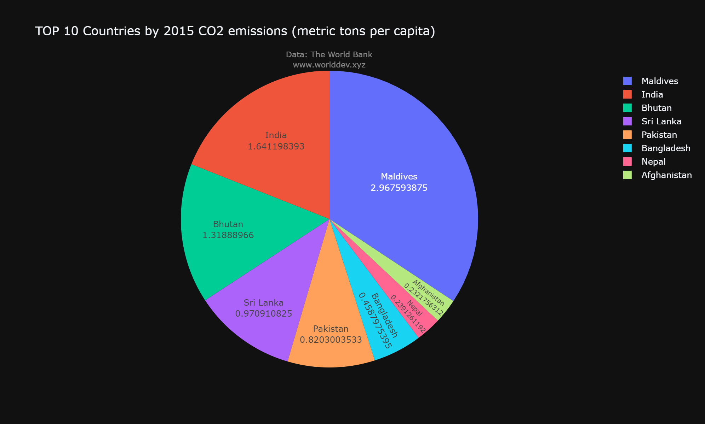
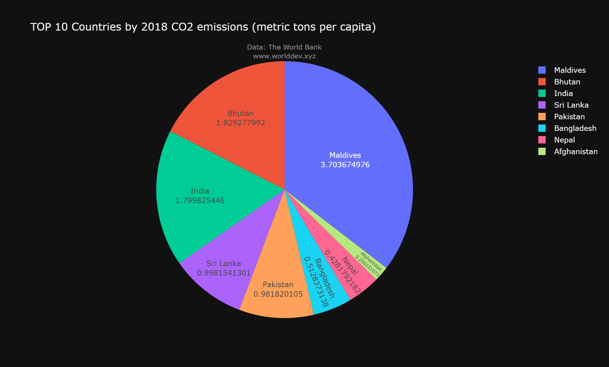
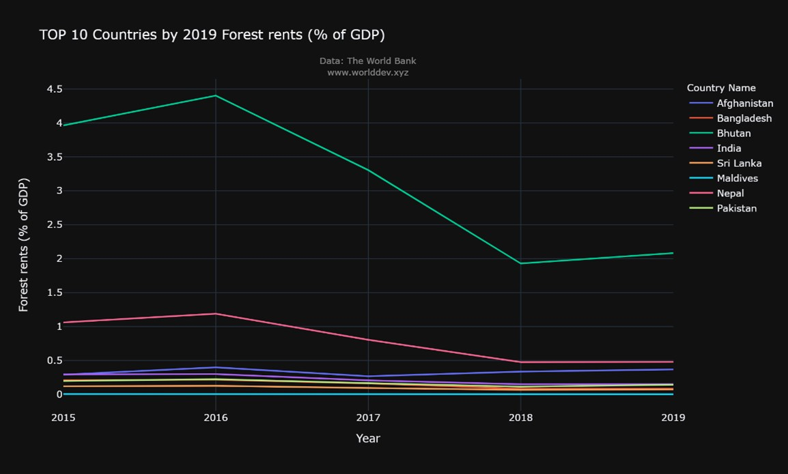

# **Final Project Part 1**
- Student Name: Nazia Noor
- Instructor: Dr. Jay Wang
- Course: Stats & Viz (DATA690)

## **Topic-  "GLOBALIZATION: A CURSE FOR ENVIRONMENT"**

> **Topic Keywords:** Economy and Growth, Environment, Globalization.

## **1.Introduction**

Over the years, the world's economy has grown significantly. The total growth impact has been boosted economic trends, facilitated cross-national trade, and diversified and localized industry in regions with comparative advantages, thanks to globalization.  However, everything has a cost. The environment is now paying a price in order to facilitate growth for the global world.

We are compromising globalization's detrimental consequences on the environment in which we live. But is this opportunity cost worthwhile?

## **2.Approach**

- This report has analyzed the impact of globalization on the environment by collecting data and visualization chart from (http://www.worlddev.xyz/).

- This report has shown the impact among the 8 South Asian countries

1.   Bangladesh
2. Maldives
3.   India
4.   Pakistan
5.   Nepal
6.   Bhutan
7.   Sri Lanka
8.   Afghanistan 

- The analysis is done on the data from 2015 to 2020.

- The indicators that have been used in this study-

1.   GDP Per Capita
2.   Industry (including construction), Value Added (% of GDP)
3.   CO2 Emission (Metric Ton Per Capita)
4.   Forest Area(% of Land Area)
5.   Forest Rent (% of GDP) *

## **3. Analysis**

Over the last decade, global awareness of the human-nature relationship has grown, raising questions on the idea of economic prosperity at the expense of the environment. More individuals are questioning globalization which is also the result of climate change, increased carbon emissions, and biodiversity loss.

Economic growth is important as well as environmental safety since this is our planet and we have to be cautious to make it suitable to live in.
According to the New York Times, the United Nations announced that countries might either have "plans to reach net-zero CO2 emissions by 2050" or "a long-term national target." Others can pursue "a long-term strategy for climate-neutrality in accordance with the Paris Agreement," a 2015 worldwide agreement aimed at mitigating the worst effects of climate change [1].

The environmental impact of globalization on South Asian countries will be discussed in this article.

## **3.1 What Is Globalization?** 

Globalization is the process of interaction and integration among people, companies, and governments worldwide. This increase in global interactions has caused a growth in international trade and the exchange of ideas, beliefs, and culture [2].  

It is defined as a combination of GDP, industrialization, and the Human Development Index (HDI) [3]. 

Globalization has made the world a more interconnected and interdependent place through trade and technology.   It is like a massive spider web that has grown over years. Globalization is a boon for the world but this has come with a price.

## **3.2 Discussing Two Indicators of Globalization**

**3.2.1 GDP Per Capita**

The GDP is a measure of a country's overall economic performance since it represents the market worth of all finished products and services produced within its borders in a given year.[4]

A good state of globalization is defined by a high GDP. In 2015, the Maldives had the highest GDP per capita of any country. It has declined over time, despite having the greatest GDP in 2020. From 2015 to 2020, the GDP of other countries grew. One of the most powerful indicators of overall economic growth is GDP. As a result, we may infer that from 2015 to 2020, South Asian countries had economic development.

**3.2.2 Industrialization**

Industrialization is a technologically-driven process that transforms a country into a modernized industrial, or developed nation, resulting in social and economic progress.[5]

Industrialization is another indicator of globalization. It stands for a better standard of living. It generates jobs for people, lowers the unemployment rate. One of the key benefits of globalization is that it allows businesses to offer affordable items to clients by mass-producing things in convenient locations. This means that there are more products available and they are less expensive, which gives firms a competitive advantage.

Bhutan was in a favorable situation in 2015, but in 2020, Bangladesh took first place. Sri Lanka's position did not change much. Other countries' contributions to adding value to GDP in the industry have decreased. We do not know the reason behind why industrialization could not contribute much to the GDP but building new industries has affected the environment.   

The construction of new industries has wreaked havoc on the environment. This is troubling since one may anticipate a more inclusive society in which environmental damage is overlooked.

## **3.3 Negative Effect of Globalization On Environment**

Industrialization is one of the main culprits of environmental degradation.
Industrialization, according to research, is the leading cause of air pollution. This is due to the fact that businesses release a variety of hazardous gases and pollutants into the atmosphere. Pollution is also caused by the use of fossil fuels. One of the main causes of air pollution is carbon dioxide, which is emitted in large quantities by industry. It raises the bar. As the amount of carbon dioxide in the atmosphere rises, so does the temperature.

**3.3.1 CO2 Emission**

Bhutan and the Maldives are the most vulnerable countries, with carbon dioxide emissions rising at an unprecedented rate in 2018. Other countries' CO2 emissions have increased as well, though not as dramatically as Bhutan and the Maldives.

Climate change impacts such as sea-level rise, ocean acidification, and extreme weather events are extremely likely to affect the Maldives, and CO2 plays a significant role in this. Former Maldives President Nasheed declared in 2009 that the country would be carbon neutral by 2020. However, by 2018, its carbon dioxide emissions had skyrocketed. Despite the government's efforts, the country's adoption of solar PV systems confronts considerable obstacles due to a lack of technical capacity, cost, and other factors. But The Maldives has committed to a 10% reduction in carbon emissions by 2030 [6].

Bhutan emits more CO2 than it takes out of the atmosphere, despite the fact that its CO2 emissions have climbed. Bhutan has the advantage of being one of the greenest countries in the world due to its location in the eastern Himalayas. Bhutan's carbon negative status, however, will soon be revoked if CO2 emissions continue to climb [7].

**3.3.2 Less Forest Area**

Forest land is determined by the country itself. Currently, forest covers 31% of the world land which is on the verge of declining. Countries should try to maintain 30% of the forest area to have a habitat for tribal people, birds. Animals, trees, etc. according to national forest policy 1988, India, there should have 33% of the land area under forest cover[8] wherein 2020, it had 24%. Except Bhutan, Nepal, and Sri Lanka, other countries are under 30%.

This is alarming because the world has lost one-third of its forest, yet an end of deforestation may recover the damage. To preserve the existing forest area, we must keep our forest area to a minimum of 30% and make every effort to expand it. As a result, global warming will be reduced, and the globe will be protected from climatal disturbance [9].

## **3.4 Forest Rent To The Rescue**

There is still time to recover from this situation.  A plethora of options for preserving our environment is available. We must need to have the intention to care for our environment.

 
Increasing forest rent is one of the options. One of the best ways to protect forests is to increase forest rent over time. Only India's forest rent has increased over the years, according to the 2019 graph. Other has declined with time. Forest rent increases will benefit the forest in two ways: first, they will add to GDP, and second, they will preserve the forest.

## **4.Conclusion**

We are so much fascinated by technological advancement, economic growth which is the result of globalization, we neglect its environmental effect. 

We must not forget this is the world we have to live in. We have to make it habitable not for ourselves but for our future generation too.

## **5.Reference**

1.   https://www.nytimes.com/interactive/2019/09/25/climate/un-net-zero-emissions.html
2.   https://en.wikipedia.org/wiki/Globalization
3.   https://www.investopedia.com/articles/economics/10/globalization-developed-countries.asp#:~:text=Globalization%20is%20a%20combination%20of%20gross%20domestic%20product,international%20trade%2C%20and%20the%20integration%20of%20financial%20markets.
4.   https://www.investopedia.com/articles/economics/10/globalization-developed-countries.asp#:~:text=The%20components%20of%20globalization%20include%20GDP%2C%20industrialization%2C%20and,a%20measure%20of%20a%20country%27s%20overall%20economic%20output.
5.   https://www.investopedia.com/articles/economics/10/globalization-developed-countries.asp#:~:text=The%20components%20of%20globalization%20include%20GDP%2C%20industrialization%2C%20and,a%20measure%20of%20a%20country%27s%20overall%20economic%20output.
6.   https://maldivesindependent.com/business/maldives-pledges-10-percent-reduction-in-carbon-emissions-by-2030-117744
7.   https://www.cnn.com/2018/10/11/asia/bhutan-carbon-negative/index.html
8.   National Forest Policy in India: Critique of Targets and Implementation-https://link.springer.com/article/10.1007/s11842-010-9133-z
9.   https://ourworldindata.org/world-lost-one-third-forests
